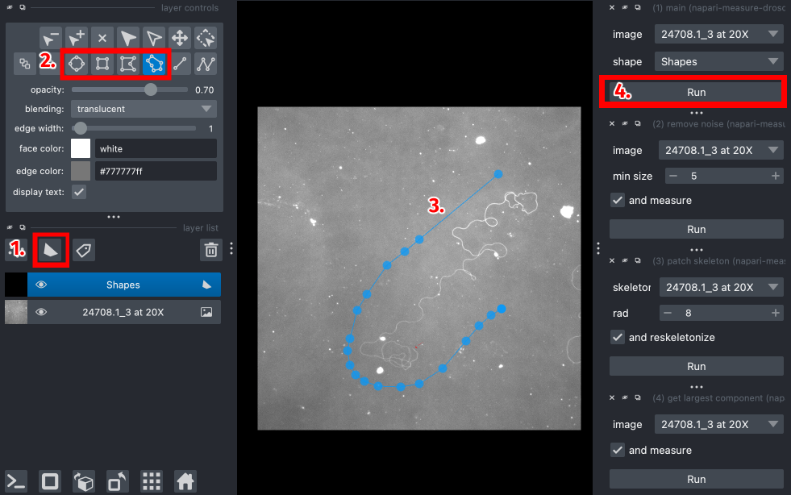
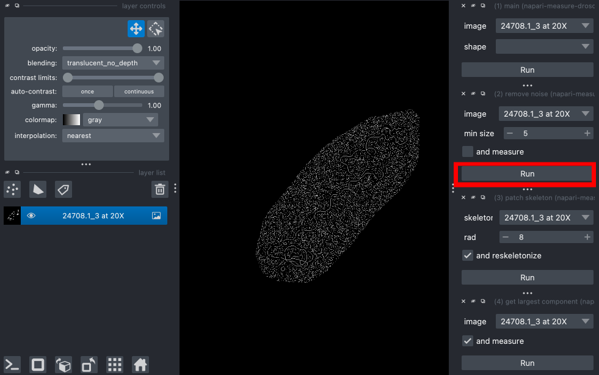
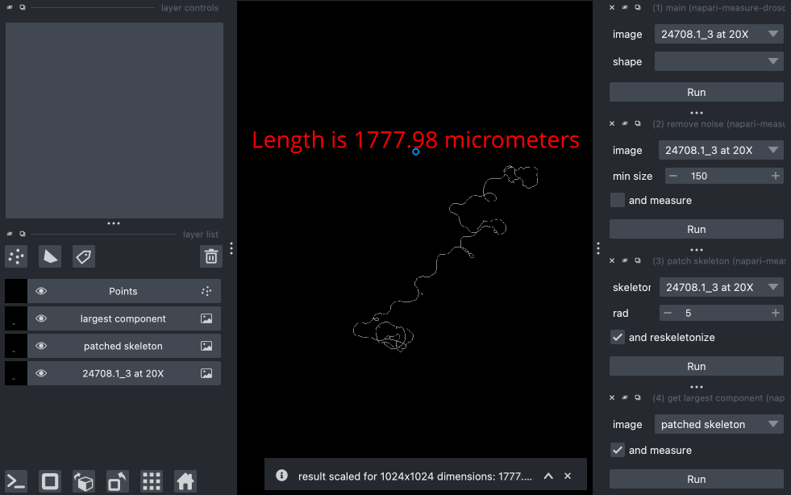

# napari-measure-drosophila-sperm

## Installation:
1. Download plugin
2. In the command line, navgiate to the plugin folder
3. `pip install -e .`

## Access:
#### Option 1:
<!-- 1. `napari -vv --with napari-measure-drosophila-sperm` from plugin folder
#### Option 2: -->
1. Go to "Plugins" in napari
2. Select "napari-measure-drosophila-sperm"

## Usage:
1. Create a new "Shapes" layer in napari
2. Select one of the shape drawing tools
3. Draw around the target cell
4. Run the "Main" plugin

5. Run the "Remove Noise" plugin, adjusting "min size" until the image is as clean as possible

6. (Optional) Use the "Patch Skeleton" and "Remove Selection" plugins to manually clean up gaps and large noise
7. Measure length of cell using the "Get Largest Component" or "Measure" plugins
